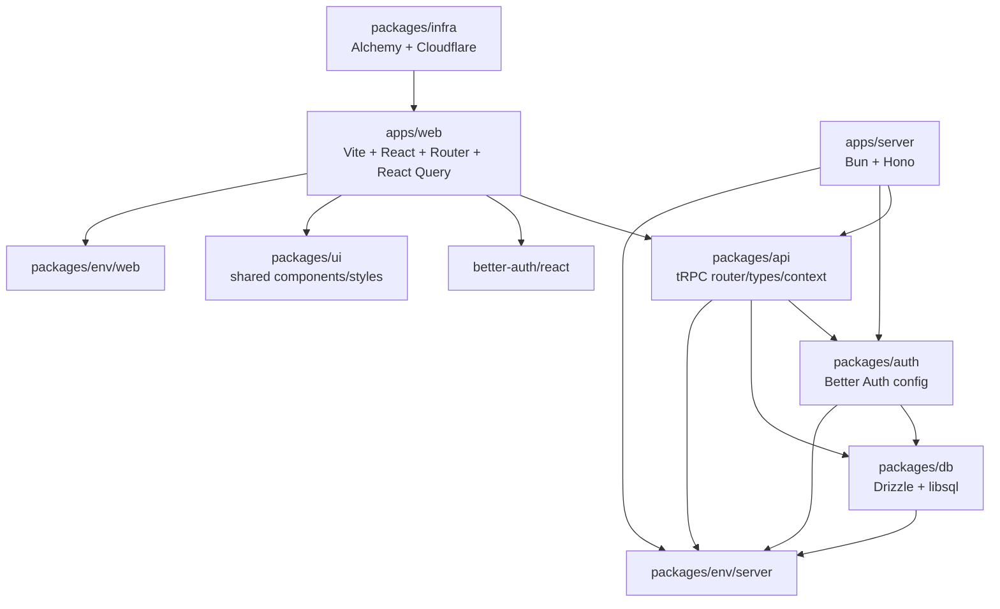
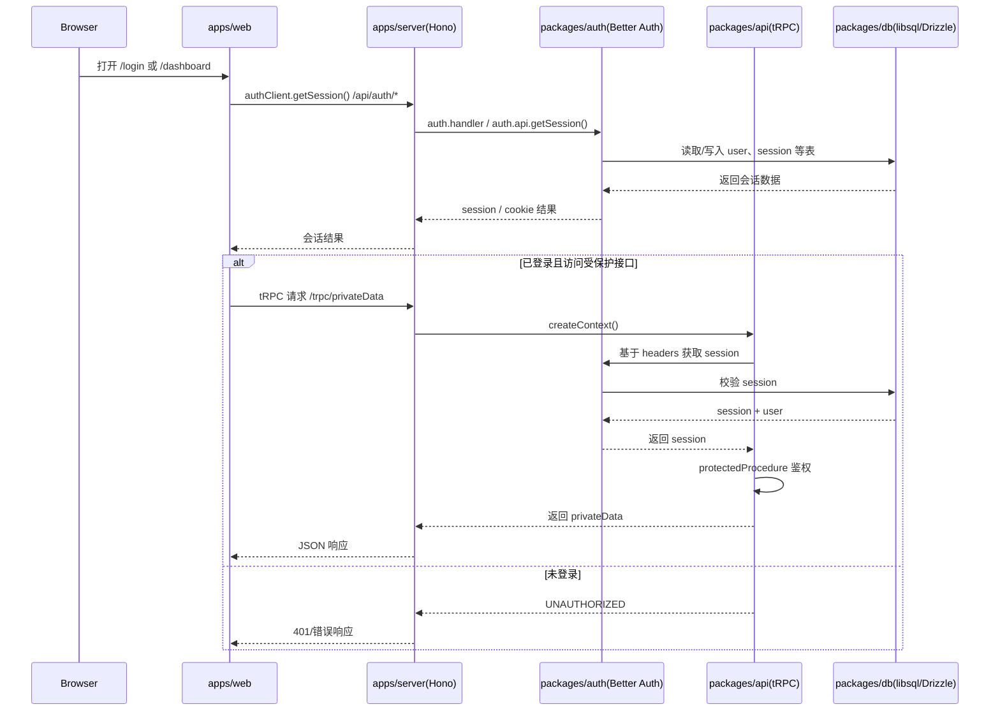

# 当前项目架构分析

## 1. 文档目的

本文档基于当前仓库中的已提交实现，对项目架构做一次面向接手开发者的现状分析。重点不是复述模板说明，而是回答下面几个问题：

- 这套项目当前是怎样组织的
- 前端、后端、共享包各自承担什么职责
- 一次页面请求、一次鉴权请求、一次受保护接口调用是如何流转的
- 工程层面有哪些支撑设施
- 当前架构已经清晰的部分是什么，还存在哪些值得后续优化的点

本文档只描述当前仓库中能被源码印证的事实，并在必要处补充推断和风险提示；不代表仓库外的部署设施全貌。

## 2. 总览结论

当前项目是一套基于 `pnpm workspace + Turborepo` 的 TypeScript monorepo，目录结构采用标准的 `apps/ + packages/` 分层。

- `apps/web` 是前端应用，技术栈为 `Vite + React 19 + TanStack Router + React Query`
- `apps/server` 是后端应用，技术栈为 `Bun + Hono + tRPC`
- `packages/*` 承载跨应用复用能力，包括 API 协议、鉴权、数据库、环境变量、UI 组件和部署脚本
- 前后端之间没有额外的 BFF 适配层，前端直接通过 `tRPC` 与后端通讯，并通过 `better-auth/react` 访问认证接口
- 数据层使用 `Drizzle ORM + libsql/Turso`，认证体系使用 `Better Auth`

从边界划分上看，这个仓库已经具备较好的模块化形态：

- 应用负责“运行时入口”和页面/HTTP 接入
- 共享包负责“协议、基础设施、复用逻辑”
- 类型在 monorepo 内部横向共享，减少前后端重复定义

## 3. 仓库结构与职责划分

### 3.1 顶层结构

```text
anime_website/
├── apps/
│   ├── server/   # Bun + Hono 后端入口
│   └── web/      # Vite + React 前端入口
├── packages/
│   ├── api/      # tRPC 路由、procedure、上下文
│   ├── auth/     # Better Auth 配置
│   ├── config/   # 共享 TypeScript 配置
│   ├── db/       # Drizzle schema、数据库连接、迁移配置
│   ├── env/      # 前后端环境变量校验
│   ├── infra/    # Alchemy / Cloudflare 部署脚本
│   └── ui/       # 共享 UI 组件和全局样式
├── turbo.json
├── pnpm-workspace.yaml
└── biome.json
```

### 3.2 `apps/web`

`apps/web` 是一个纯前端应用，核心职责是页面渲染、路由切换、会话感知和 API 调用。

当前可以确认的实现特征：

- 使用 `Vite` 作为构建与开发服务器
- 使用 `TanStack Router` 进行文件路由
- 使用 `React Query` 作为服务端状态管理层
- 使用 `@trpc/client` + `@trpc/tanstack-react-query` 调用后端
- 使用 `better-auth/react` 管理登录态
- UI 组件优先复用 `@anime_website/ui`

当前页面规模还比较轻量，主要包括：

- `/`：健康检查展示页
- `/login`：登录/注册页
- `/dashboard`：受保护页面，演示会话与私有接口调用

### 3.3 `apps/server`

`apps/server` 是后端入口层，主要职责是组装 HTTP 服务，而不是承载全部业务逻辑。

它当前承担的工作包括：

- 挂载 `Hono` 应用
- 配置日志与 CORS
- 把 `/api/auth/*` 转发给 Better Auth 处理
- 把 `/trpc/*` 接到 `packages/api` 中定义的 tRPC router
- 为 tRPC 请求创建上下文

这意味着服务端入口层偏薄，核心规则尽量放到了共享包中，方向上是合理的。

### 3.4 `packages/api`

`packages/api` 是协议与接口层，负责把前后端共享的 API 类型和鉴权规则放在一起。

它当前提供：

- `t`、`router`、`publicProcedure`、`protectedProcedure`
- `createContext()`：从请求头里读取会话
- `appRouter`：当前包含 `healthCheck` 与 `privateData`

这个包的价值在于：

- 前端调用和后端实现共享同一套路由类型
- 鉴权逻辑可以在 `protectedProcedure` 层统一处理
- API 层不必散落在应用目录里

### 3.5 `packages/auth`

`packages/auth` 专门负责 Better Auth 配置，是整个认证体系的收口点。

当前实现包含：

- 使用 `drizzleAdapter(db)` 连接数据库
- 使用 `packages/db/schema/auth.ts` 中的认证相关表结构
- 启用邮箱密码登录
- 读取 `BETTER_AUTH_SECRET`、`BETTER_AUTH_URL`、`CORS_ORIGIN`
- 配置跨站 cookie 属性

这个包将“认证框架配置”和“应用入口”解耦，前后端都不需要重复定义认证行为。

### 3.6 `packages/db`

`packages/db` 负责数据层接入，当前更偏基础设施层，而不是复杂领域模型层。

已落地的内容包括：

- 基于 `@libsql/client` 创建数据库连接
- 基于 `drizzle-orm/libsql` 暴露 `db`
- 定义 Better Auth 所需的用户、会话、账户、校验表
- 提供 `drizzle-kit` 配置与数据库脚本

从现状看，这个包目前主要服务于认证体系，业务表和业务查询层尚未展开。

### 3.7 `packages/env`

`packages/env` 用 `@t3-oss/env-core` 做前后端环境变量的声明式校验。

职责分为两部分：

- `@anime_website/env/server`：服务端环境变量
- `@anime_website/env/web`：前端环境变量

当前已显式约束的关键变量有：

- 服务端：`DATABASE_URL`、`BETTER_AUTH_SECRET`、`BETTER_AUTH_URL`、`CORS_ORIGIN`、`NODE_ENV`
- 前端：`VITE_SERVER_URL`

这能减少环境配置错误导致的运行时问题，是当前架构里比较稳的一层。

### 3.8 `packages/ui`

`packages/ui` 是共享 UI 组件库，承担跨应用复用的展示层基础设施。

当前内容包括：

- 一组基础组件，如 `button`、`input`、`card`、`dropdown-menu`
- 全局样式 `globals.css`
- 工具函数 `cn` 所在的工具层
- shadcn 相关配置

`apps/web` 的设计系统依赖这个包，因此视觉规范和基础交互可以在 monorepo 内集中维护。

### 3.9 `packages/infra`

`packages/infra` 负责部署侧脚本，目前可以确认它使用 `Alchemy` 面向 Cloudflare 发布 `apps/web` 的 Vite 产物。

从当前实现看，它具备这些特征：

- 读取根下和 `apps/web` 下的 `.env`
- 将 `apps/web/dist` 作为静态资源输出
- 向前端注入 `VITE_SERVER_URL`

这个包目前更像“前端部署入口”，尚未体现服务端同样完整的部署编排。

## 4. 模块依赖关系

下面这张图描述的是当前仓库的主要依赖方向，而不是 npm 层面的每一条细节依赖。



可以看到，这套架构已经形成了比较明确的“入口层依赖共享层”的方向：

- 应用层没有彼此直接耦合
- 共享包之间的依赖总体较可控
- `api -> auth/db/env` 构成了后端核心基础链路

## 5. 运行时链路分析

## 5.1 普通页面与 API 调用链路

首页 `/` 的行为是当前最简单的一条链路：

1. 前端路由进入 `apps/web/src/routes/index.tsx`
2. 页面通过 `trpc.healthCheck.queryOptions()` 发起查询
3. `apps/web/src/utils/trpc.ts` 中的客户端把请求发送到 `${VITE_SERVER_URL}/trpc`
4. `apps/server/src/index.ts` 中的 Hono 将 `/trpc/*` 请求交给 `trpcServer`
5. `packages/api/src/routers/index.ts` 中的 `healthCheck` 返回 `"OK"`
6. React Query 回填页面状态

这说明当前 API 调用采用的是：

- 前端直连后端
- tRPC 负责协议和类型共享
- React Query 负责缓存、状态与错误处理

## 5.2 登录与注册链路

登录/注册页面使用的是 `better-auth/react` 客户端，而不是走 tRPC。

链路如下：

1. 用户在 `/login` 页面提交表单
2. 前端调用 `authClient.signIn.email()` 或 `authClient.signUp.email()`
3. 请求发往 `${VITE_SERVER_URL}/api/auth/*`
4. Hono 在 `/api/auth/*` 路由上把请求直接交给 `auth.handler`
5. Better Auth 通过 `drizzleAdapter` 访问数据库
6. 会话写入认证表，并通过 cookie 回到浏览器

这里的关键点是：认证链路和业务 API 链路是分开的。

- 认证接口由 Better Auth 自己接管
- 业务接口由 tRPC 处理
- 两条链路最终都依赖同一份数据库和会话体系

## 5.3 受保护路由与受保护接口链路

`/dashboard` 展示了“前端路由守卫 + 后端接口守卫”的双层保护思路。

前端侧：

- `beforeLoad` 中先调用 `authClient.getSession()`
- 没有会话时，直接跳转到 `/login`

后端侧：

- tRPC `createContext()` 从请求头中读取会话
- `protectedProcedure` 检查 `ctx.session`
- 没有会话则抛出 `UNAUTHORIZED`

这说明当前架构没有把安全性只压在前端路由判断上，后端接口也保留了真正的权限门槛，这是合理的。

下面这张时序图可以更直观看到整条链路。



## 6. 工程支撑架构

### 6.1 Monorepo 与任务编排

仓库使用 `pnpm-workspace.yaml` 管理工作区，使用 `turbo.json` 统一编排任务。

当前根层脚本主要起调度作用：

- `dev`
- `build`
- `check-types`
- `db:*`
- `deploy`
- `destroy`

`turbo.json` 中当前已声明的任务包括：

- `build`
- `lint`
- `check-types`
- `dev`
- `db:push`
- `db:generate`
- `db:migrate`
- `db:studio`
- `db:local`
- `deploy`
- `destroy`

其中：

- `build` 依赖上游包的 `build`
- `dev` 是常驻任务，不走缓存
- 数据库和部署相关任务默认不走缓存

这套配置符合 monorepo 的常见组织方式，说明项目具备继续扩展为多应用/多包仓库的基础。

### 6.2 TypeScript 配置

仓库根 `tsconfig.json` 继承 `packages/config/tsconfig.base.json`。

基础配置已经统一了：

- `strict`
- `moduleResolution: bundler`
- `verbatimModuleSyntax`
- `noUncheckedIndexedAccess`
- `noUnusedLocals`
- `noUnusedParameters`

这意味着类型约束是从根层统一下沉的，包之间不会出现太明显的编译规则漂移。

### 6.3 环境变量治理

当前环境变量治理的特点是：

- 服务端和前端分开声明
- 各自只暴露自己应该使用的变量
- 使用 `zod` 做运行前校验

这是当前项目里比较成熟的一部分，也为后续分环境部署提供了基础。

### 6.4 代码风格与提交门禁

仓库使用：

- `Biome` 做格式化与静态检查
- `Husky + lint-staged` 做 pre-commit 校验

当前 `lint-staged` 会对匹配文件执行 `biome check --write .`，说明团队倾向于在提交前自动修复一部分格式问题。

### 6.5 生成文件与开发体验

`apps/web/src/routeTree.gen.ts` 是 TanStack Router 的生成文件，不应被视为核心业务代码。

从当前配置看：

- 它参与前端路由运行
- 但已经在 `biome.json` 中被显式忽略
- 分析和维护重点应放在 `src/routes/*` 与 `src/main.tsx` 上，而不是这个生成结果本身

## 7. 当前架构的优点

从现状出发，这套架构已经有几项明显优点：

- 前后端边界明确：前端入口、后端入口、共享包职责分离清晰
- 类型联通顺滑：tRPC 让前后端共享接口类型，降低协议漂移成本
- 鉴权路径集中：Better Auth 被包裹在 `packages/auth` 中，配置收口良好
- 基础设施可复用：数据库、环境变量、UI、部署能力都拆成了可复用包
- 适合继续扩展：当前虽然业务较轻，但仓库结构已经适合新增更多页面、更多 router、更多共享模块

## 8. 风险、模糊点与优化建议

以下内容不是“代码错误清单”，而是基于当前实现给出的架构层观察。

### 8.1 根脚本使用 `turbo` 简写

根 `package.json` 里的脚本目前使用的是：

- `turbo dev`
- `turbo build`
- `turbo check-types`

从可读性和 Turborepo 官方推荐习惯来看，写成 `turbo run <task>` 会更统一，也更适合后续在 CI、脚本模板和团队规范中保持一致。

建议：

- 后续把根脚本逐步调整为 `turbo run dev`、`turbo run build` 等形式
- 在新增脚本时优先使用 `turbo run`

### 8.2 README 与当前实现存在潜在偏差

README 中的部分描述仍带有模板项目痕迹，例如部署说明和运行说明更像通用脚手架文案。

从当前仓库代码看：

- Web 端开发端口明确配置为 `3001`
- Server 端入口没有在 `src/index.ts` 中硬编码监听端口
- `packages/infra` 当前主要体现的是前端 Vite 产物部署

建议：

- 后续单独整理 README，按当前真实实现更新开发、部署、端口和职责说明
- 在没有补齐服务端部署链路前，不要让 README 给人“部署闭环已经完整”的印象

### 8.3 `packages/infra` 目前更偏前端部署，而不是全栈部署

`packages/infra/alchemy.run.ts` 当前只明确了 `apps/web` 的构建产物发布流程。

这说明现状更接近：

- 前端部署路径相对明确
- 后端服务如何部署、在哪里部署、是否和前端共站点或分服务部署，仓库内没有完整体现

建议：

- 如果后续要走生产化，应补一份“部署拓扑说明”
- 需要明确 server 的运行位置、域名、CORS 策略和环境变量来源

### 8.4 Cookie 策略依赖跨域与 HTTPS 环境

当前 Better Auth 配置了：

- `sameSite: "none"`
- `secure: true`
- `httpOnly: true`

这类配置通常用于跨站点 cookie，但也意味着本地开发、测试环境和生产环境需要满足相应条件，否则容易出现“登录成功但拿不到会话”的问题。

建议：

- 后续补充一份鉴权环境说明，明确 `BETTER_AUTH_URL`、`CORS_ORIGIN`、`VITE_SERVER_URL` 的配套关系
- 在 README 或开发文档中单独说明跨域 cookie 的预期行为

### 8.5 `packages/api/context.ts` 仍有扩展空间

当前 `createContext()` 返回的是：

- `session`
- `auth: null`

这说明上下文模型已经预留了扩展位置，但还没有真正挂载更多能力，比如：

- 数据库实例
- 当前请求元信息
- 统一日志追踪字段
- 权限信息或租户信息

建议：

- 随着业务增长，可以逐步把上下文设计成后端标准入口容器
- 但在当前项目规模下，不必过早复杂化

### 8.6 数据层目前主要围绕认证表

当前 `packages/db` 的 schema 基本都服务于 Better Auth。

这本身没问题，但也说明：

- 项目还处在基础能力搭建阶段
- 业务领域模型尚未开始沉淀

建议：

- 当业务表开始增加时，考虑把“认证 schema”和“业务 schema”在目录上进一步区分
- 当查询逻辑变复杂时，可新增 repository/service 层，而不是把所有查询直接堆在路由层

### 8.7 自动化测试体系尚未体现

当前仓库里可以看到类型检查、格式化和提交门禁，但没有看到成体系的自动化测试目录或测试脚本。

建议：

- 前端可以优先补充路由级或组件级测试
- 后端可以优先补充 tRPC procedure 的鉴权与返回值测试
- 认证与会话链路至少应有一条集成测试或冒烟测试

## 9. 对后续演进的建议

如果项目接下来继续发展，比较自然的演进路径大致如下：

### 9.1 短期

- 更新 README，使之与当前实现一致
- 补一份开发环境说明，尤其是跨域 cookie 与环境变量关系
- 把根层 `turbo` 简写统一成 `turbo run`

### 9.2 中期

- 在 `packages/api` 中扩充更多 router，并逐步形成更清晰的领域划分
- 在 `packages/db` 中沉淀业务 schema 和查询层
- 为 server 增加更完整的部署与运行说明

### 9.3 长期

- 视业务复杂度决定是否引入更清晰的领域边界，例如 `packages/domain` 或更细的 API/router 分层
- 根据部署形态，评估是否需要把前后端进一步标准化为完整的多环境发布流程

## 10. 总结

这套项目当前已经具备一个比较健康的基础架构骨架：

- monorepo 组织合理
- 前后端职责边界清晰
- 类型、鉴权、数据库、环境变量都已经开始模块化

它目前更像是一个“基础设施层已搭好、业务层尚轻”的项目阶段。后续工作的重点不一定是推翻架构，而是沿着现在这条分层思路继续补齐：

- 文档一致性
- 部署闭环
- 鉴权环境说明
- 测试覆盖
- 业务层沉淀

如果按当前方向继续演进，这套结构是有能力支撑后续扩展的。
